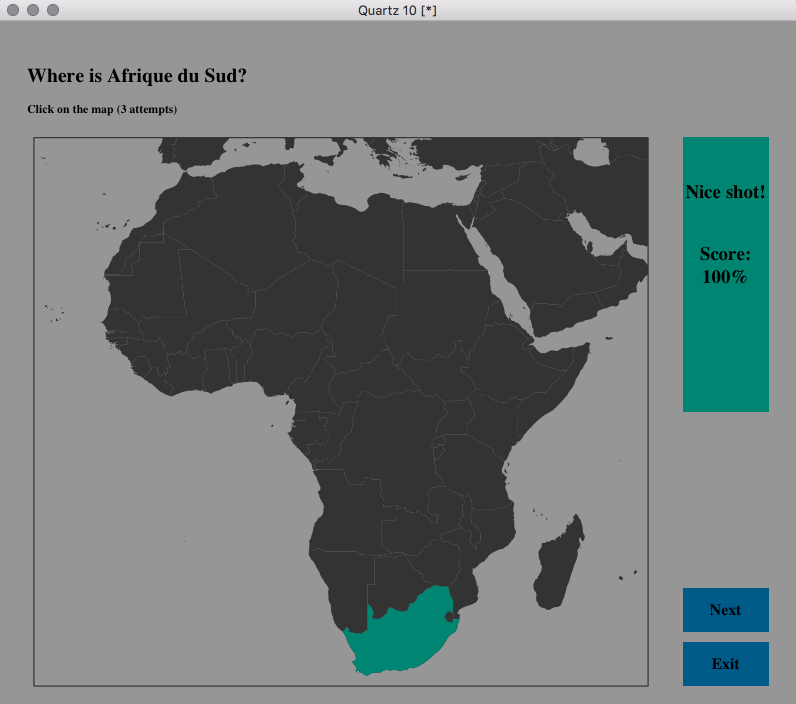

# geographr

An R package to have fun with geography.

<!--  -->


## Installation

You can install this package from Github:

```r
### First install the devtools package (if not already installed)
install.packages('devtools')
library(devtools)

### Then install the geographr package
devtools::install_github('ahasverus/geographr')
```

## Documentation

The `geographr` package contains four main functions.

###### Learn about countries geography and flag

```r
learn_country()
```

###### Try to identify country on map

```r
where_is(region = 'africa')
where_is(region = 'europa', lang = 'fr')
```

###### Try to find country from its flag

```r
guess_flag()
```

###### Try to locate country on map

```r
guess_country()
```

## License

This package is licensed to you under the terms of the [GNU General Public
License](http://www.gnu.org/licenses/gpl.html) version 3 or later.
