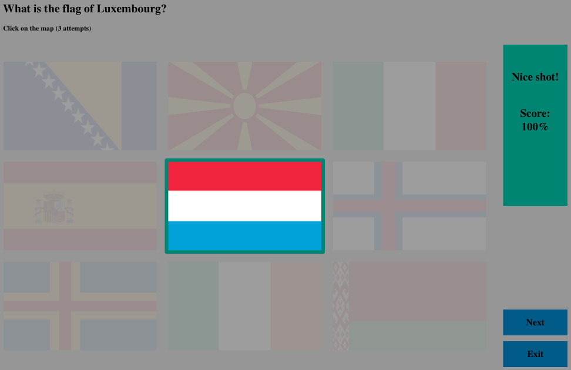

> In development...

# geographr

An R package to test your skills in world geography.

## Installation

You can install this package from Github.

```r
### First install the devtools package (if not already installed)
install.packages('devtools')

### Then install the geographr package
library(devtools)
devtools::install_github('ahasverus/geographr')

### And load the package
library(geographr)
```

## Documentation

The `geographr` package contains six main functions. All of these functions are available in two different languages: english (en) and french (fr). English is the default in all the functions.

#### Refine your geographic skills

```r
#### Default settings
learning(region = 'world', lang = 'en')

#### Short version
learning()

#### User settings usage
learning(region = 'south america', lang = 'fr')
```


#### Getting the correct spelling of countries and regions

```r
#### Get the correct spelling of regions
get_region_name()
get_region_name(lang = 'fr')

#### Get the correct spelling of countries
get_country_name()
get_country_name(lang = 'fr')
```

#### Identify countries on the map

```r
#### Default settings
find_country(region = 'europa', lang = 'en')

#### Short version
find_country()

#### User settings usage
find_country(region = 'africa', lang = 'fr')
```


#### Identify national flags

```r
#### Default settings
find_flag(region = 'world', lang = 'en')

#### Short version
find_flag()

#### User settings usage
find_flag(region = 'asia', lang = 'fr')
```



#### Locate n cities on the map

```r
#### User settings usage
find_cities(country = 'france', n = 10, lang = 'en')

#### or
find_cities(country = 'FrAnCe', n = 10, lang = 'en')
```


Do not overload the map with a too higher number of towns.

## Notes

Cities and world shapefile come from the [maps](https://cran.r-project.org/web/packages/maps/index.html) package. High resolution shapefiles come from [GADM](http://gadm.org).

For a better visual experience, please do not resize graphical windows.

The function `find_cities()` needs more development. But it works. Enjoy!

## License

This package is licensed to you under the terms of the [GNU General Public
License](http://www.gnu.org/licenses/gpl.html) version 3 or later.
