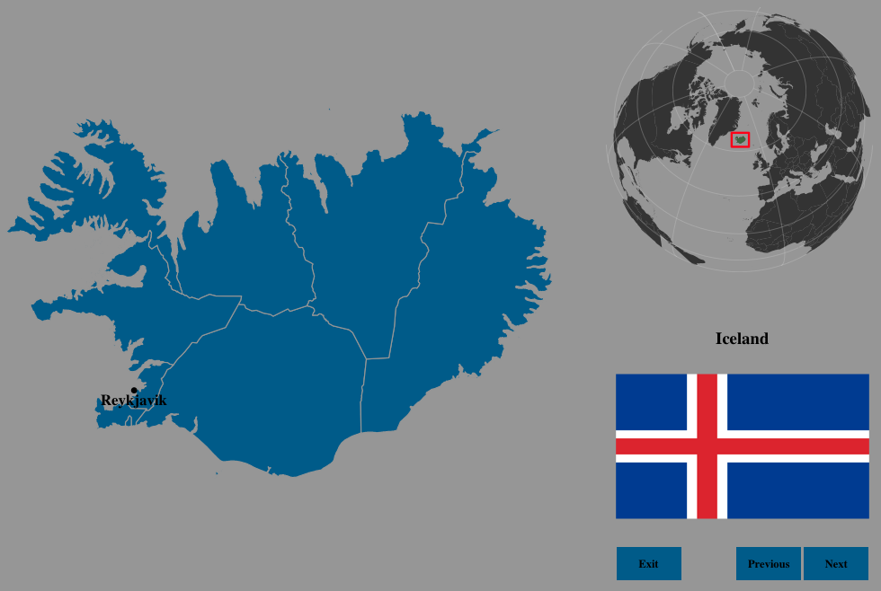
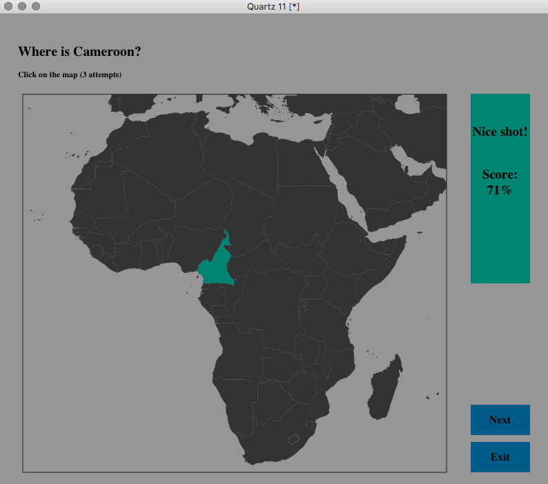

> In development...

# geographr

An R package to have fun with geography.

## Installation

You can install this package from Github:

```r
### First install the devtools package (if not already installed)
install.packages('devtools')
library(devtools)

### Then install the geographr package
devtools::install_github('ahasverus/geographr')

### And load the package
library(geographr)
```

## Documentation

The `geographr` package contains four main functions.

#### Refine your geographic skills

```r
learning(region = 'world')
learning(region = 'south america')
```



#### Identify countries on the map

```r
find_country(region = 'africa')
find_country(region = 'europa', lang = 'fr')
```



#### Identify national flags

```r
find_flag(region = 'world')
find_flag(region = 'asia', lang = 'en')
```

#### Locate cities on the map

```r
find_cities(country = 'france', n = 10)
```

## Notes

For a better visual experience, please do not resize graphical windows.

## License

This package is licensed to you under the terms of the [GNU General Public
License](http://www.gnu.org/licenses/gpl.html) version 3 or later.
